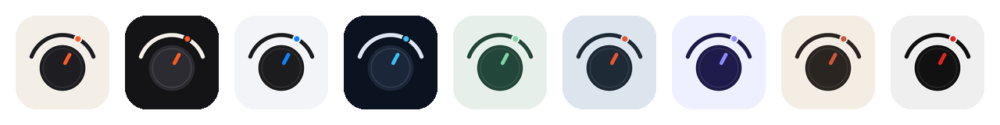
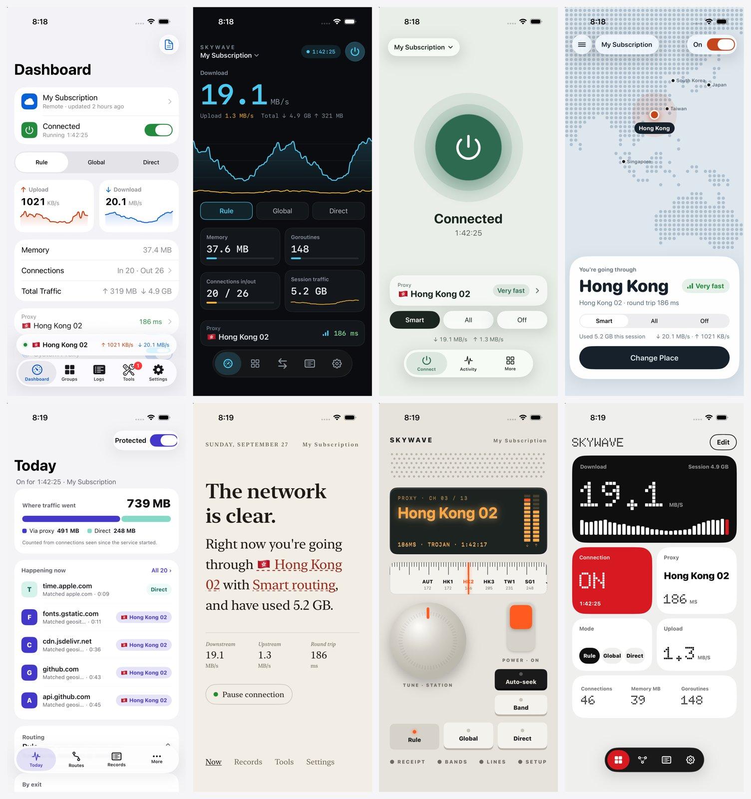
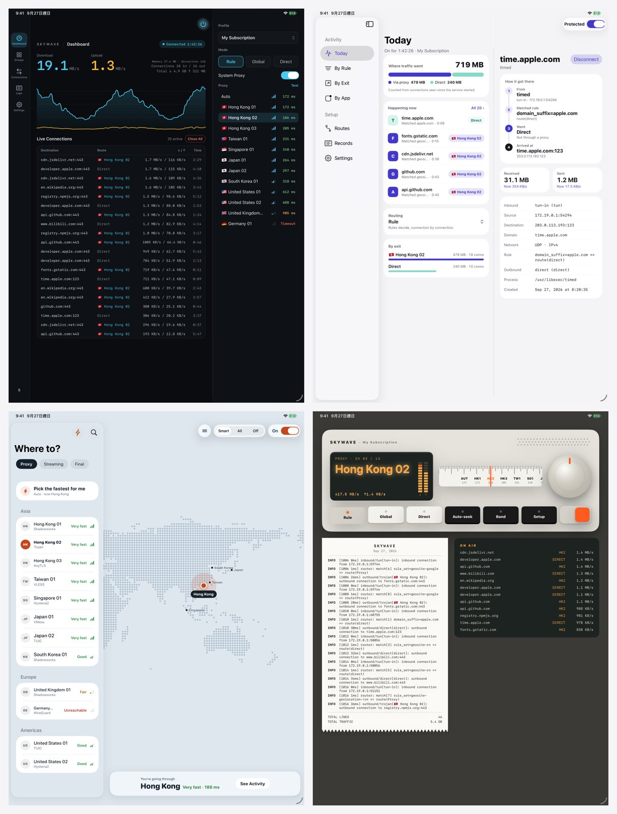

# Skywave · 天波

[English](README.md) · **简体中文**

> **非官方。** 天波是独立的第三方项目，并非由其所用网络核心的开发者制作、认可或维护，也不是官方客户端。

Skywave 为一个开源通用代理平台（sing-box，<https://github.com/SagerNet/sing-box>）的 Apple 客户端提供第三方皮肤。它用八套可随时切换的界面替换客户端原有的导航，**功能一个不改**。

上游许可证不允许衍生作品使用上游名称或暗示与其有关联，所以天波不会出现上游名称：App 名为 Skywave，上游的所有图标都被替换，App 本身也会注明自己是非官方的（首次启动页和"设置 › 关于"）。

名字来自短波电台："天波"是被高空电离层反射、越过山海传到远方的信号。图标是一个旋钮，指针正对着天空弧线上的一个电台。打开"App 图标跟随皮肤"后，图标会换成每套皮肤的配色：





## 皮肤

| 皮肤 | 适合 | 思路 |
|---|---|---|
| **系统原生** | 想要稳定熟悉的人 | 像 Apple 亲手做的：Liquid Glass、标签栏、分组卡片 |
| **深色仪表** | 爱看实时数据的进阶用户 | 深色控制台，所有数字一览无余，信息密集的表格 |
| **一键连接** | 只想网络好用的人 | 一个大电源键，一个当前地点 |
| **地点** | 更喜欢大白话的人 | 点阵世界地图，节点就是地点，延迟就是"路况" |
| **透明** | 想弄懂分流规则的人 | 追踪每个连接：App → 规则 → 分组 → 出口 |
| **一句话** | 喜欢安静、优美排版的人 | 用一句话讲清当前状态，点划线词即可修改 |
| **收音机** | 喜欢实体按键手感的人 | 液晶屏、带触感反馈的调谐旋钮和琴键，日志像小票一样打印出来 |
| **模块拼贴** | 爱折腾、想自定义的人 | 模块自由排列，点阵数字 |

每套皮肤都有 iPhone 布局，以及适用于 iPad 和 Mac 的宽屏布局：



所有皮肤都有以下共同功能：

- **首次启动选风格**：缩略图是真实界面的实时缩小版；"设置 › 外观"里是同一个选择器。
- **命令面板（⌘K）**：按 ⌃⌘S 轮换皮肤。
- **用语**：可选"日常用语"（智能分流、很快）或"专业术语"（Rule、186 ms）。
- **各设备独立**：每台设备记住自己的皮肤选择，不做同步，版本不同的设备之间也不会冲突。
- **App 图标**：可选让 App 图标跟随皮肤变化。
- **小组件和实时活动**：主屏幕和锁屏小组件、实时活动、灵动岛。
- **语言**：英文、简体中文、繁体中文。

上游的"配置""工具""设置"页面仍使用上游代码，由皮肤承载并套用皮肤的配色。

## 环境要求

- iOS / iPadOS 26 或 macOS 26
- Xcode 26 及以上（Swift 6.2 工具链）

## 目录结构

```
Sources/SkywaveShared   格式化、用语、小组件快照、深度链接（App 与小组件共用）
Sources/Skywave         皮肤、通用页面、状态存储、主题、系统界面同步
Sources/SkywaveWidgets  状态小组件与实时活动
Integration/Apple      Skywave 与上游 Apple 客户端之间的对接代码
Integration/TypeCheck  上游接口的签名替身，无需编译 Libbox 即可对对接代码做类型检查
Integration/apply_to_upstream.py   把 Skywave 接入上游代码的脚本
Demo/                  使用模拟数据的独立演示 App（xcodegen）
Scripts/l10n           翻译表与字符串目录生成脚本
```

## 运行演示

```bash
brew install xcodegen
```

```bash
cd Demo && xcodegen && open SkywaveDemo.xcodeproj
```

演示 App 支持以下启动参数：

- `-skywave-skin <native|instrument|focus|places|lens|sentence|radio|bento>`：指定皮肤。
- `-skywave-scenario <live|frozen|stopped|empty>`：指定模拟数据。
- `-skywave-onboarding`：显示首次启动的风格选择页。

## 编译正式客户端

见 [INTEGRATION.md](INTEGRATION.md)。简单说，对上游 `clients/apple` 运行一个脚本，然后照常编译即可。

## 开发

```bash
swift test
```

```bash
swift build --package-path Integration/TypeCheck
```

```bash
python3 Scripts/l10n/build_catalogs.py
```

- `swift test`：运行单元测试。设置 `SKYWAVE_SNAPSHOTS=<目录>` 时，还会渲染每套皮肤的 Mac 快照。
- `Integration/TypeCheck`：用签名替身对上游对接代码做类型检查。
- `build_catalogs.py`：修改界面文字后，用它重新生成字符串目录。

架构说明见 [DESIGN.md](DESIGN.md)。

## 许可证

Skywave 是自由软件，采用 GNU 通用公共许可证第 3 版或更高版本，见 [LICENSE](LICENSE) 和 [COPYING](COPYING)。

内置的点阵字体派生自 Doto（SIL Open Font License 1.1），见 `Sources/Skywave/Resources/Fonts/OFL.txt`。世界地图数据来自 Natural Earth（公有领域）。
